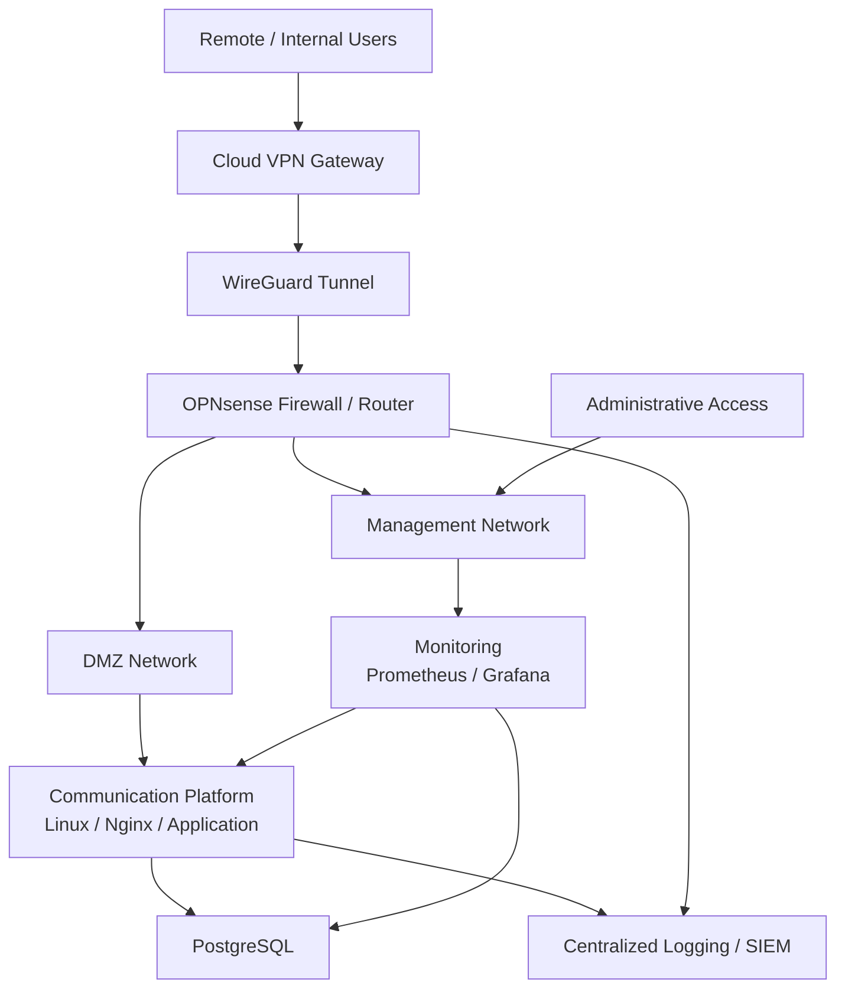

# Infrastructure Portfolio

Practical infrastructure portfolio focused on Linux systems, virtualization, networking, VPN connectivity, monitoring, security and troubleshooting.

This repository is based on hands-on production infrastructure experience. All published examples are **sanitized and reconstructed**: addresses, domains, hostnames, credentials, organizational details and other sensitive information have been replaced with documentation-only values.

## Profile

**Anton Honcharenko** — Infrastructure & Systems Engineer

Primary areas: Linux / Ubuntu Server, Proxmox VE, OPNsense, WireGuard / OpenVPN, Nginx, PostgreSQL, Prometheus / Grafana, routing, NAT, firewalling, centralized logging and infrastructure troubleshooting.

## Featured Case Study

### Secure Self-Hosted Communication Infrastructure

A sanitized production-oriented case study covering design, deployment, monitoring and troubleshooting of a secure self-hosted communication environment.

**Key technologies:** Proxmox VE · Linux · OPNsense · WireGuard · Nginx · PostgreSQL · Matrix Synapse · Coturn · Prometheus · Grafana

[Open the full case study →](case-studies/secure-communication-platform/README.md)

## Portfolio Highlights

### Architecture

A sanitized production-oriented infrastructure design including:

- Proxmox virtualization
- OPNsense firewall and routing
- DMZ / management network segmentation
- WireGuard connectivity
- Nginx reverse proxy
- PostgreSQL-backed services
- Prometheus and Grafana monitoring

[View architecture →](case-studies/secure-communication-platform/README.md#infrastructure-architecture)

### Monitoring

Real sanitized monitoring examples demonstrate:

- Linux VM resource monitoring
- Service availability
- Prometheus exporter status
- WireGuard tunnel state
- Handshake monitoring
- Network traffic visibility

[View monitoring examples →](case-studies/secure-communication-platform/README.md#monitoring--observability)

### Incident Case Studies

- [Cloud VPN Gateway Migration](case-studies/secure-communication-platform/incidents/cloud-vpn-migration.md)
- [Multi-WAN Failover Troubleshooting](case-studies/secure-communication-platform/incidents/wan-failover.md)

## High-Level Architecture



## What This Portfolio Demonstrates

- Segmented infrastructure design
- Linux service operations
- VPN and routed connectivity
- Routing, NAT and firewall policies
- Prometheus / Grafana monitoring
- PostgreSQL-backed services
- Nginx reverse proxy concepts
- Multi-WAN and failover validation
- Centralized logging
- Cross-layer incident troubleshooting
- Production-oriented documentation

## Repository Structure

```text
infrastructure-portfolio/
├── case-studies/secure-communication-platform/
├── examples/monitoring/
├── examples/nginx/
├── examples/wireguard/
├── examples/scripts/
├── automation/ansible/
├── automation/docker/
└── docs/
```

## Public Portfolio Safety

This repository intentionally contains no real production secrets or topology identifiers. See [Disclosure Policy](docs/disclosure-policy.md).

## LinkedIn

https://www.linkedin.com/in/anton-honcharenko-mtx/
