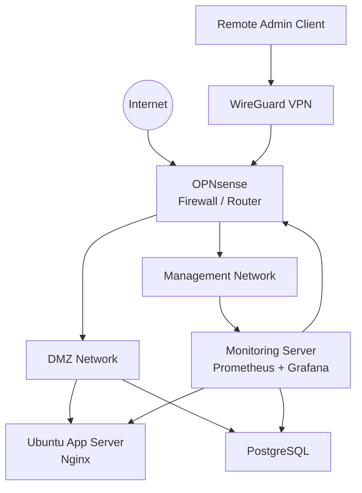

# Production-Style Infrastructure Lab

A practical infrastructure portfolio project focused on Linux administration, virtualization, networking, VPN connectivity, monitoring, reverse proxying and infrastructure troubleshooting.

The lab is designed to demonstrate production-oriented infrastructure skills using a safe, fully synthetic environment with no real company data, credentials or production configuration.

## Core Technologies

- Proxmox VE
- Linux / Ubuntu Server
- OPNsense
- WireGuard
- Nginx
- Prometheus
- Grafana
- node_exporter
- PostgreSQL monitoring
- Bash

## Architecture



## What This Lab Demonstrates

- Segmented network design with DMZ and management zones
- Firewall and routing concepts
- Secure remote access through WireGuard
- Linux service deployment
- Nginx reverse proxy configuration
- Infrastructure monitoring with Prometheus and Grafana
- Health checks and operational Bash scripts
- Alert rule examples
- Troubleshooting documentation
- Safe configuration examples suitable for a public portfolio

## Repository Structure

```text
infrastructure-lab/
├── README.md
├── docs/
│   ├── architecture.md
│   ├── deployment.md
│   ├── security.md
│   └── troubleshooting.md
├── monitoring/
│   ├── prometheus.yml
│   └── alert-rules.yml
├── nginx/
│   └── reverse-proxy.conf
├── wireguard/
│   ├── README.md
│   ├── wg-server.example.conf
│   └── wg-client.example.conf
├── scripts/
│   ├── check-wireguard.sh
│   ├── service-health.sh
│   └── disk-usage-alert.sh
├── ansible/
│   └── README.md
└── docker/
    └── README.md
```

## Lab Goals

The project is intentionally practical rather than theoretical. Each component should be deployed, tested and documented.

### Phase 1 — Core Infrastructure
- [x] Define architecture
- [x] Add safe configuration examples
- [ ] Build Proxmox virtual lab
- [ ] Configure OPNsense
- [ ] Create DMZ and MGMT networks
- [ ] Deploy Linux virtual machines
- [ ] Configure WireGuard access
- [ ] Deploy Nginx
- [ ] Deploy Prometheus and Grafana
- [ ] Configure node_exporter
- [ ] Add alerts and dashboards

### Phase 2 — Automation
- [ ] Add Ansible inventory and playbooks
- [ ] Automate Linux baseline configuration
- [ ] Automate node_exporter deployment
- [ ] Automate Nginx deployment

### Phase 3 — Containers
- [ ] Add Docker Compose monitoring stack
- [ ] Compare native-service vs containerized deployment

## Security Notes

This repository must never contain:

- Private keys
- Passwords or API tokens
- Real public IP addresses
- Internal company hostnames
- Production DNS names
- Sensitive network diagrams
- Real user data

All examples use documentation-only addresses and placeholder secrets.

## Author

**Anton Honcharenko**  
Infrastructure & Systems Engineer

LinkedIn: `https://www.linkedin.com/in/anton-honcharenko-mtx/`
