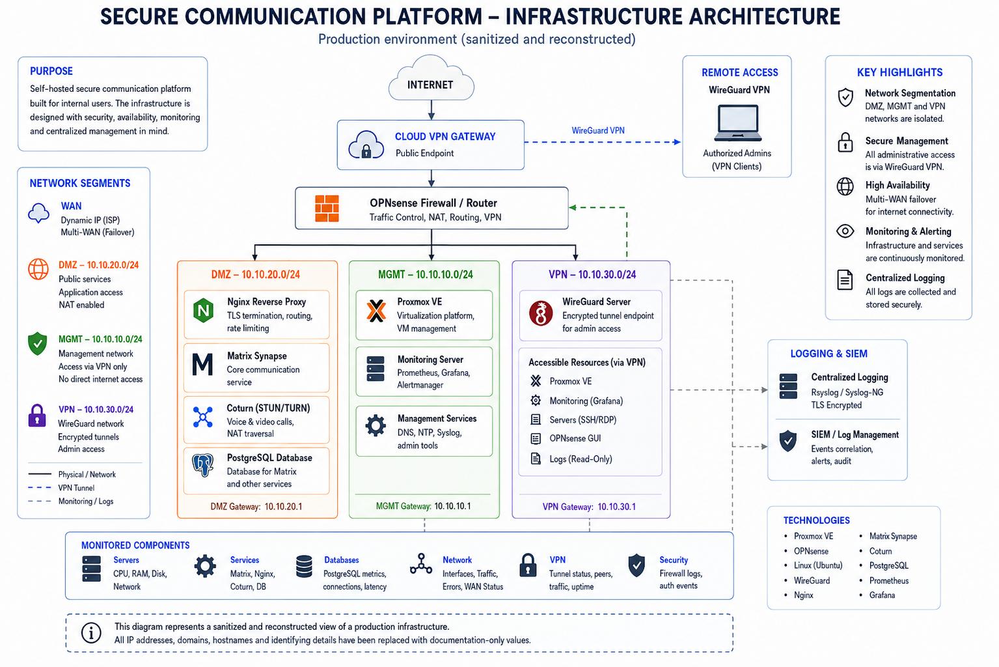

# Secure Self-Hosted Communication Infrastructure

## Overview

This case study describes a **sanitized reconstruction** of a production self-hosted communication infrastructure that I designed, deployed, maintained and troubleshot as part of my infrastructure engineering responsibilities.

The public version removes or changes sensitive details while preserving the technical concepts, design decisions and troubleshooting approach.

## Infrastructure Architecture

> Sanitized and reconstructed architecture based on hands-on production experience.  
> IP addresses, domains, hostnames and identifying details have been replaced with documentation-only values.

## Objectives

- Self-hosted communication services
- Controlled external access
- Segmented service and management networks
- Secure remote administration
- VPN-based connectivity between environments
- Reverse proxy and TLS termination
- PostgreSQL-backed application services
- Real-time communication support
- Centralized infrastructure monitoring
- Network failover visibility
- Centralized logging

## Technology Stack

| Layer | Technologies |
|---|---|
| Virtualization | Proxmox VE |
| Operating System | Linux / Ubuntu Server |
| Firewall / Routing | OPNsense |
| VPN | WireGuard |
| Reverse Proxy | Nginx |
| Application | Matrix Synapse / Element |
| Database | PostgreSQL |
| Real-Time Communications | Coturn / TURN |
| Monitoring | Prometheus / Grafana |
| Metrics | node_exporter / postgres_exporter / custom metrics |
| Logging | rsyslog / centralized SIEM forwarding |
| Cloud Connectivity | Cloud VM gateway |

## Responsibilities

- Deployed and maintained Linux virtual machines
- Configured routed and segmented networks
- Implemented DMZ and management network separation
- Built WireGuard connectivity between environments
- Configured routing, NAT and firewall policies
- Deployed and maintained Nginx reverse proxy configuration
- Supported PostgreSQL-backed services
- Implemented Prometheus and Grafana monitoring
- Built infrastructure health dashboards and alerts
- Configured centralized log forwarding
- Troubleshot connectivity, VPN, routing, service and application incidents
- Supported cloud infrastructure migration
- Implemented and validated network failover behavior

## Documentation

- [Architecture](architecture.md)
- [Networking](networking.md)
- [Monitoring](monitoring.md)
- [Security](security.md)
- [Troubleshooting](troubleshooting.md)

## Selected Incident Case Studies

- [Cloud VPN Migration and Connectivity Troubleshooting](incidents/cloud-vpn-migration.md)
- [Multi-WAN Failover Validation](incidents/wan-failover.md)

> This repository is a portfolio artifact, not a production configuration backup.
