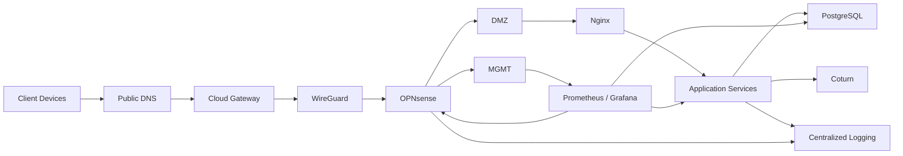

# Architecture

## Design Principles

1. **Network separation** — application-facing and administrative services are placed in separate security zones.
2. **Limited administrative exposure** — management interfaces are reachable only through approved paths.
3. **VPN-based interconnection** — WireGuard links external/cloud-facing infrastructure with internal service networks.
4. **Centralized monitoring** — infrastructure health is monitored independently from the application path.
5. **Layered troubleshooting** — incidents are investigated from network reachability through application behavior.

## Sanitized Example Addressing

| Zone | Example |
|---|---|
| Management | 10.10.10.0/24 |
| DMZ | 10.10.20.0/24 |
| VPN | 10.10.30.0/24 |

No real production subnets are published here.
